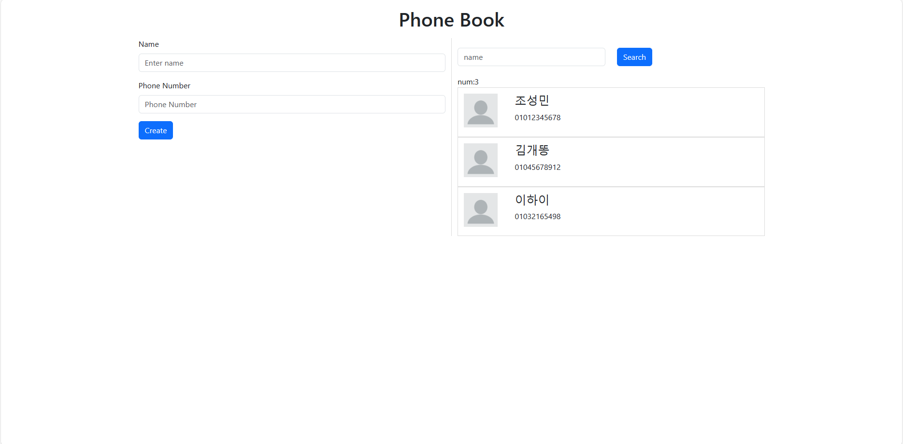

# 연락처 웹사이트



Redux, React-Redux 라이브러리의 상태관리를 이용한 간단한 연락처 웹사이트입니다.

## 주요기능

⭐ 연락처 추가

- 이름과 전화번호를 입력하여 연락처를 추가할 수 있습니다.

⭐ 연락처 리스트

- 추가한 연락처를 오른쪽에 연락처 리스트로 보여줍니다.

⭐ 검색

- 필요한 연락처를 검색하여 찾아낼 수 있습니다.

## 설치 및 실행

```jsx
$ git clone https://github.com/chobuzz/phonebook.git
$ cd phonebook
```

### Installation

```jsx
$ npm install
$ npm start
```
